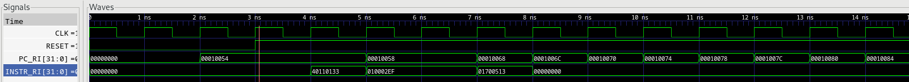
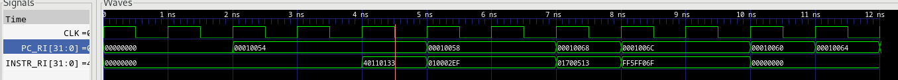

# MASSOC - Compte-rendu TP2

## Comprendre le Minirsicv

- *run.exe* est l'exécutable du processeur décrit en SystemC.\
- *app* est l'application compilée en assembleur.

### Mise en place

Compiler:
>>
    $ source ./systemc-env.sh
    make clean && make -j
    riscv32-unknown-elf-gcc -nostdlib -c SW/reset.s -o reset.o -march=rv32imc
    riscv32-unknown-elf-gcc -nostdlib -c SW/app.s -o app.o -march=rv32imc
    riscv32-unknown-elf-gcc -nostdlib reset.o app.o -T SW/link.ld -o app -march=rv32imc

Tester l'application:
>>
    $ ./run.exe app

Observer le contenu du programme compilé:
>>
    $ riscv32-unknown-elf-objdump -d app > app.txt

### Fichier test et observation GTK-WAVE
On compile puis on exécutre l'application:
>>
    $ ./compile.sh
    $ ./run.exe app

On observe ce résultat:
>>
    
    SystemC 2.3.4-Accellera --- Aug 16 2026 17:50:15
    Copyright (c) 1996-2022 by all Contributors,
    ALL RIGHTS RESERVED
    Receiving file app, starting parsing and reading
    Chargement du segment .text.reset adr = 0x   10050, total size : 0x18
    Chargement du segment .text adr = 0x   10068, total size : 0x4
    Found _good at : 0x   10060
    Found _bad at : 0x   10064
    Number of Instruction : 0
    Reseting...
    Info: (I702) default timescale unit used for tracing: 1 ps (tf.vcd)
    done.
    Test ended at 10084
    signature_name :
    begin_signature :6
    end_signature :0
    $

On observe dans gtkwave:

PC_RI : adresses de l'instruction\
ID_RI : code de l'instruction

Au 3ème cycle, l'instruction pointée par PCRI est sub de *reset.s*.\

Au 6ème cycle, l'instruction jal est exécutée pour aller dans la section main.

Au 8ème cycle, l'instruction addi dans *app.s* de main est pointée par PCRI.

Puis dans les cylces suivants, PCRI s'incrémente de 4 en 4 mais le code de l'instruction ID_RI est 0000000 donc ne correspond à aucune instructions. Le programme ne trouve pas de nouvelle instruction et s'arrête 9 cycles après.

Pour visualiser les adresses des instructions, voir le fichier *app.txt* après compilation.

Après l'ajout de l'instruction 
> j _good

dans le fichier *app.s*, on observe la trace d'exécution suivante:
>>
    $ ./run.exe app
    SystemC 2.3.4-Accellera --- Aug 16 2026 17:50:15
    Copyright (c) 1996-2022 by all Contributors,
    ALL RIGHTS RESERVED
    Receiving file app, starting parsing and reading
    Chargement du segment .text.reset adr = 0x   10050, total size : 0x18
    Chargement du segment .text adr = 0x   10068, total size : 0x8
    Found _good at : 0x   10060
    Found _bad at : 0x   10064
    Number of Instruction : 0
    Reseting...
    Info: (I702) default timescale unit used for tracing: 1 ps (tf.vcd)
    done.
    Success ! Found good at adr 0x10060

On observe dans gtkwave:

En observant le chronogramme on voit que PC_RI prend la valeur 10060 correspondant à l'adresse de _good, ce qui signifie que le programme a finit correctement son exécution.

### Test de l'instruction addi

On fait le test de l'application suivante:
>>
    00010068 <main>:
        10068:	058d                addi	a1,a1,3
        1006a:	00100013          	li	zero,1
        1006e:	0509                addi	a0,a0,2
        10070:	00050033          	add	zero,a0,zero
        10074:	00058463          	beqz	a1,1007c <add_success>
        10078:	fedff06f          	j	10064 <_bad>

    0001007c <add_success>:
        1007c:	fe5ff06f          	j	10060 <_good>
(structure de l'application obtenue avec la commande riscv32-unknown-elf-objdump)

On observe sur Gtkwave que l'on passe bien de l'adresse 10074 à l'adresse 1007c ce qui signifie que le branchement a fonctionné confirmant le succès de l'instruction *add*.